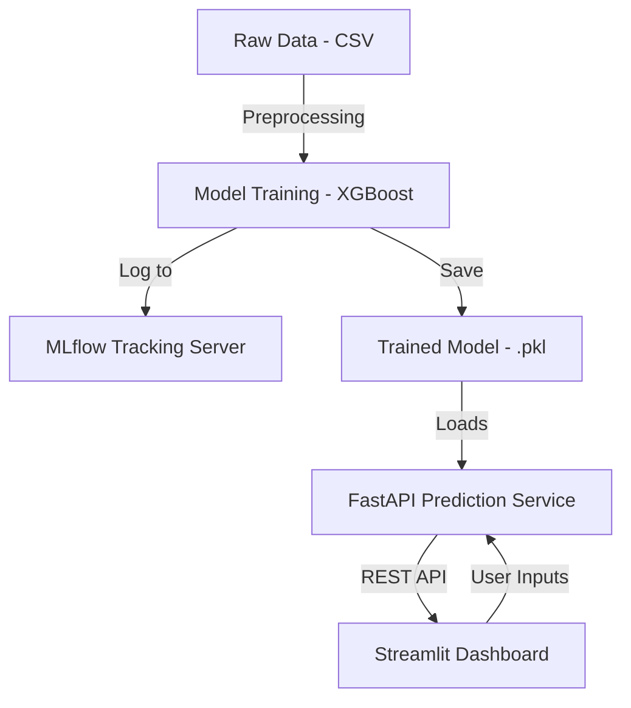

# 🧠 MLOps Customer Churn Prediction Project

Predict whether a telecom customer is likely to churn using a machine learning model served with FastAPI and visualized with Streamlit. This project demonstrates a production-ready MLOps stack with MLflow tracking, Docker containerization, and local inference APIs.

---

## 📌 Table of Contents

* [Overview](#overview)
* [Project Architecture](#project-architecture)
* [Tech Stack](#tech-stack)
* [Features](#features)
* [Getting Started](#getting-started)

  * [1. Clone the Repo](#1-clone-the-repo)
  * [2. Train the Model](#2-train-the-model)
  * [3. Start FastAPI Server](#3-start-fastapi-server)
  * [4. Run Streamlit Dashboard](#4-run-streamlit-dashboard)
  * [5. Use Docker (Optional)](#5-use-docker-optional)
* [API Usage](#api-usage)
* [Streamlit Dashboard](#streamlit-dashboard)
* [MLflow Tracking](#mlflow-tracking)
* [Project Structure](#project-structure)
* [Future Improvements](#future-improvements)

---

## 🧠 Overview

This project builds a customer churn prediction pipeline:

* Trains an XGBoost model on telco customer data
* Serves predictions via a FastAPI REST API
* Visualizes predictions and input forms via Streamlit
* Tracks experiments using MLflow

---

## 🏗 Project Architecture



---

## 🔧 Tech Stack

* **Python 3.10**
* **FastAPI** – RESTful model server
* **Streamlit** – interactive frontend for predictions
* **XGBoost** – classifier
* **Pandas/Scikit-learn** – data manipulation and encoding
* **MLflow** – experiment logging and model registry
* **Docker** – containerized app

---

## ✨ Features

* Real-time customer churn predictions
* Model training and evaluation
* API-first architecture
* Visual dashboard
* MLflow experiment tracking

---

## 🚀 Getting Started

### 1. Clone the Repo

```bash
git clone https://github.com/your-username/mlops-churn-prediction.git
cd mlops-churn-prediction
```

### 2. Train the Model

```bash
python src/train_model.py
```

This:

* Trains an XGBoost model
* Logs run to MLflow
* Saves `models/xgb_model.pkl` and `models/training_columns.txt`

### 3. Start FastAPI Server

```bash
uvicorn api.main:app --reload
```

Server runs at: [http://localhost:8000](http://localhost:8000)

### 4. Run Streamlit Dashboard

```bash
cd dashboard
streamlit run app.py
```

Opens: [http://localhost:8501](http://localhost:8501)

### 5. Use Docker (Optional)

```bash
docker build -t churn-api .
docker run -p 8000:8000 churn-api
```

---

## 📬 API Usage

### POST `/predict`

```json
{
  "gender": "Male",
  "SeniorCitizen": 0,
  "Partner": "Yes",
  "Dependents": "No",
  "tenure": 5,
  "PhoneService": "Yes",
  "InternetService": "DSL",
  "MonthlyCharges": 75.3,
  "TotalCharges": 300.5
}
```

**Response:**

```json
{
  "churn": true
}
```

Swagger UI: [http://localhost:8000/docs](http://localhost:8000/docs)

---

## 📊 Streamlit Dashboard

The Streamlit dashboard provides an interactive UI to test your model with user inputs.

### Usage Instructions

1. Make sure the FastAPI server is running on `localhost:8000`.
2. Run the dashboard:

```bash
cd dashboard
streamlit run app.py
```

3. Enter customer details in the sidebar input fields.
4. Click the **"Predict Churn"** button.
5. The app will show whether the customer is predicted to churn or not.

### Screenshot

* You can embed a screenshot here for GitHub users:

```md

```

---

## 📊 MLflow Tracking

To view MLflow UI:

```bash
mlflow ui
```

Visit: [http://localhost:5000](http://localhost:5000)

Tracks:

* Parameters (model config)
* Metrics (accuracy)
* Artifacts (model, input schema)

---

## 📁 Project Structure

```
mlops-churn-prediction/
├── api/
│   └── main.py            # FastAPI app
├── dashboard/
│   └── app.py             # Streamlit dashboard
├── data/
│   └── telco_churn.csv    # Dataset
├── models/
│   ├── xgb_model.pkl      # Trained model
│   └── training_columns.txt
├── src/
│   ├── train_model.py     # Model training + MLflow logging
│   ├── predict.py         # Prediction logic
│   └── schema.py          # Pydantic input schema
├── requirements.txt
├── Dockerfile
└── README.md
```
